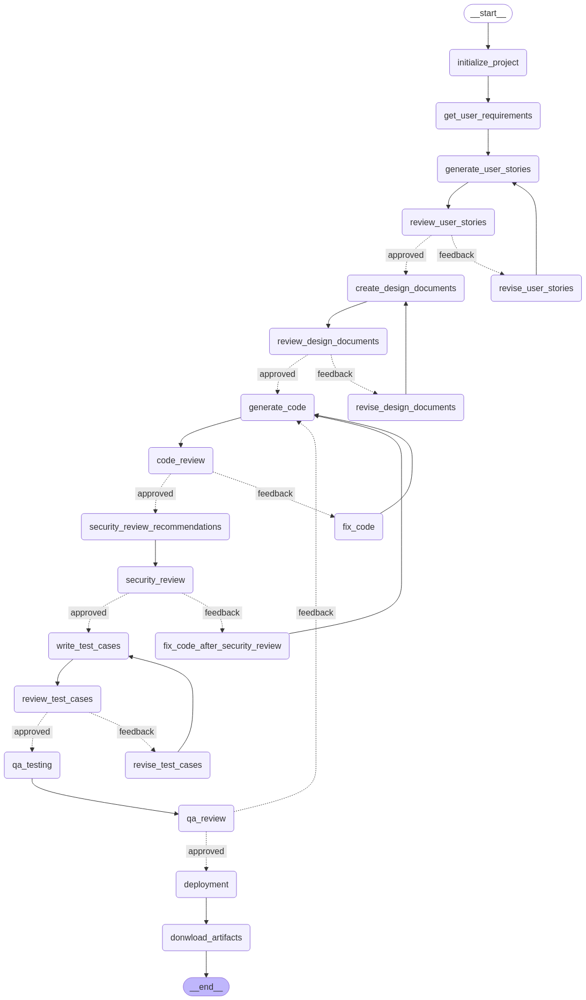

# DevPilot

## _Pilot your entire software lifecycle from idea to release_

## Overview
DevPilot is an end-to-end solution designed to automate your entire software development lifecycle. This project leverages a modular, graph-based architecture to transform user requirements into a fully deployed solution. It handles everything from collecting user requirements and generating user stories to creating design documents, code generation, security and test reviews, and deployment. In addition, Markdown artifacts for each phase are automatically generated and made available for download.

DevPilot uses a state-driven graph (powered by [LangGraph](https://www.langchain.com/langgraph)) with conditional routing to manage the process. The project also integrates with Redis (optionally hosted externally) for caching and state persistence, and provides a visual workflow diagram of the entire process.

## Features
- **End-to-End SDLC Automation:** Automates every stage of the software development lifecycle—from project initialization to deployment.
- **Graph-Based Orchestration:** Uses a state-driven graph with conditional routing to manage SDLC tasks.
- **Artifact Generation:** Automatically generates Markdown documentation for:
  - Project Requirements
  - User Stories
  - Design Documents (Functional & Technical)
  - Generated Code
  - Security Recommendations
  - Test Cases
  - QA Testing Comments
  - Deployment Feedback
- **Interactive Review & Feedback:** Dynamic review cycles at multiple stages with options to approve or provide feedback with Humman-in-the-Loop.

## Project Structure
```plaintext
DevPilot/
├── artifacts/              # Generated Markdown artifact files
├── src/
│   └── dev_pilot/
│       ├── cache/          # Redis cache and state persistence
│       ├── graph/          # Graph builder and related logic
│       ├── LLMS/           # LLM integrations (Gemini, Groq, OpenAI, etc.)
│       ├── nodes/          # Individual nodes handling each SDLC phase (requirements, coding, etc.)
│       ├── state/          # SDLC state definitions and data models
│       ├── ui/             # UI components (e.g., Streamlit front-end, if any)
│       ├── utils/          # Utility functions or classes (formatting, helpers, etc.)
├── app.py                  # Main entry script (e.g., Streamlit or other CLI)
├── LICENSE
├── README.md
├── requirements.txt        # Python dependencies
├── workflow_graph.png      
├── .env                    # Environment variables (API keys, etc.)
└── .gitignore
```

## Setup Instruction
- Clone the repo
- Create a virtual environment
- Install the requirements
- Install Docker Desktop
- Pull the Redis image using `docker pull redis`
- Run the Redis container using `docker run -p 6379:6379 redis` (Docker is used to store the state of the graph in Redis)
- Run the streamlit app using `streamlit run app.py`


## Workflow Graph


### TODO
- Fast API Integration
- Deploy as a docker on AWS
